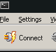

#### EasyTerm

Easyterm connects to BPQ via the `AGWPORT` in the bpq32.cfg above.  

Settings->Station Setup

Connect to BPQ emulator click:

Now we can connect to BPQ by using the following and clicking connect.  Otherwise you can also choose 
The RF ports and connect directly out of easyterm.

Here is the output plus a few commands. The commands are shown by having :> at the start of the lines.

The very bottom window will also act as a monitor, or you can click the monitor button too.

This config of BPQ Emulator + Direwolf/(Qt)SoundModem + EasyTerm may get interesting.  With BPQ and UZ7HO 
soundmodem driver in BPQ in the above allows one to control CAT controlled rig frequency and change the 
QtSoundModem channels center frequency and modulation type.   Cat control varies up rig, based up hamlib
I think. G8BPQ could tell you better there but I would probably look at hamlib first.   